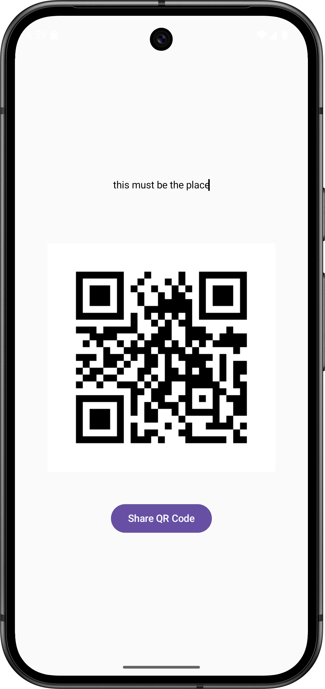
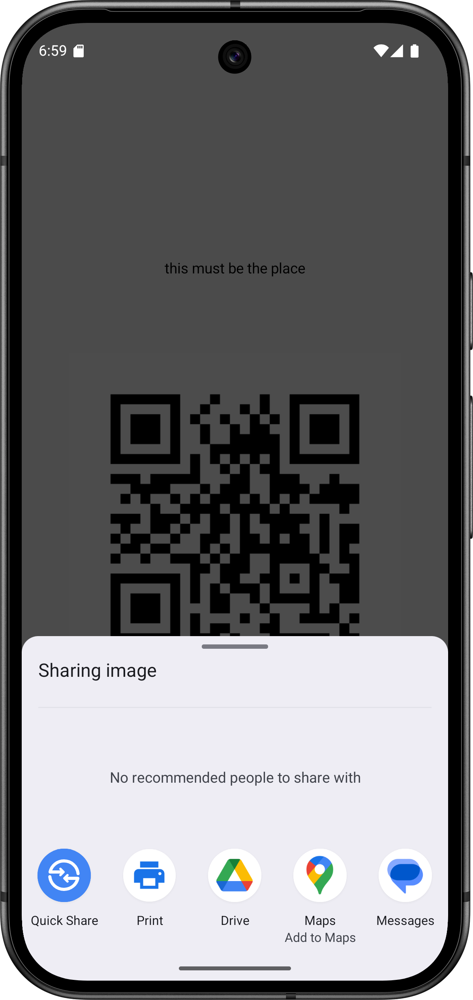
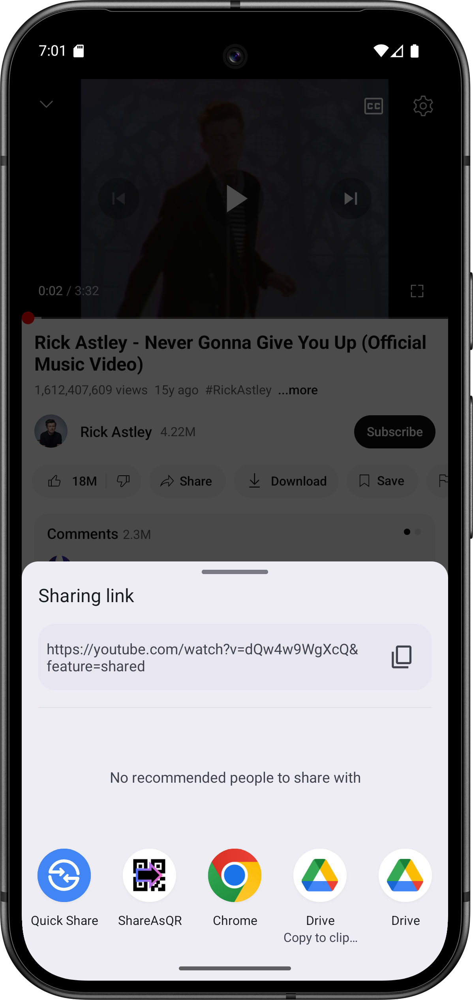

# ShareAsQR

**ShareAsQR** is a lightweight Android app designed to make generating QR codes as simple and efficient as possible. Unlike other apps, ShareAsQR focuses solely on QR code generation, keeping the app small and fast.

### Features:
- **QR Code Generation**: Quickly generate QR codes from any text input or shared content from other apps.
- **Share Generated QR Codes**: Easily share the generated QR code as an image via messaging apps, email, or other platforms.

### Why No QR Code Scanning?
This app does **not** include QR code scanning functionality because it's unnecessary. Android's native camera app already has built-in support for scanning QR codes, so there’s no need for redundancy. This decision keeps the app lightweight and focused, resulting in a very small APK size.

### How to Use:
1. Open the app and input any text manually or paste the text directly into the text input field.
2. You can also share text from other apps (e.g., a browser, notes, or messaging apps) and the app will automatically generate a QR code.
3. Tap the "Share QR Code" button to share the QR code image with others.

### Why Use ShareAsQR?
- **Lightweight**: The app only generates QR codes, so it stays small and efficient.
- **No Bloat**: No unnecessary features like scanning since Android's native camera can already handle that.

### Screenshots:
#### Share custom text

#### Share generated QR as image

#### Share text/links from other apps
